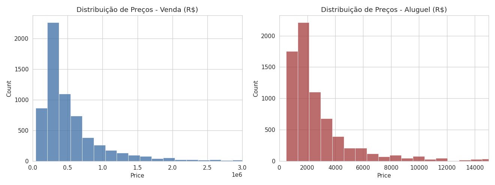
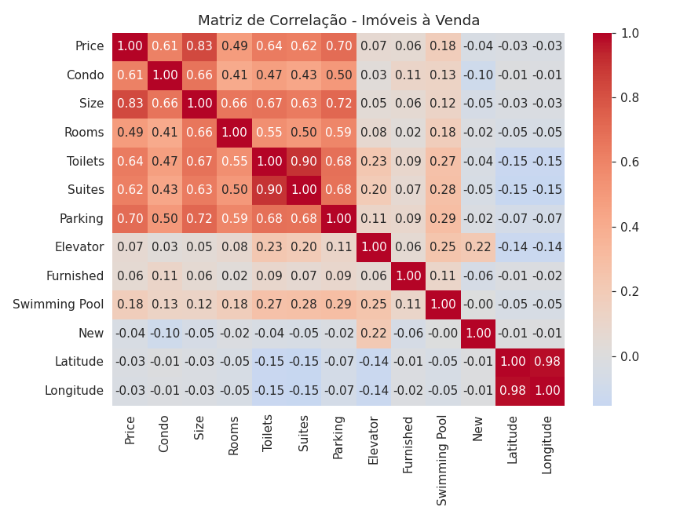
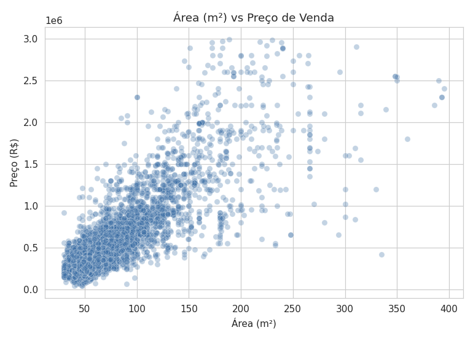
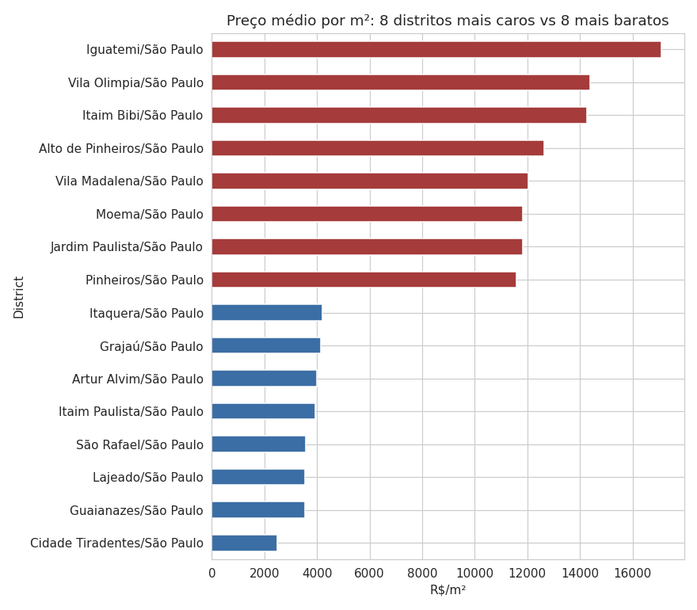
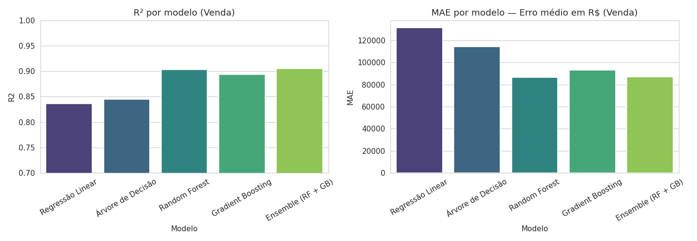
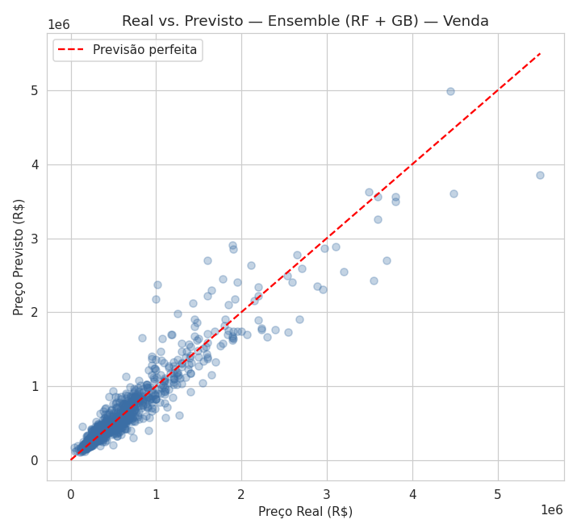
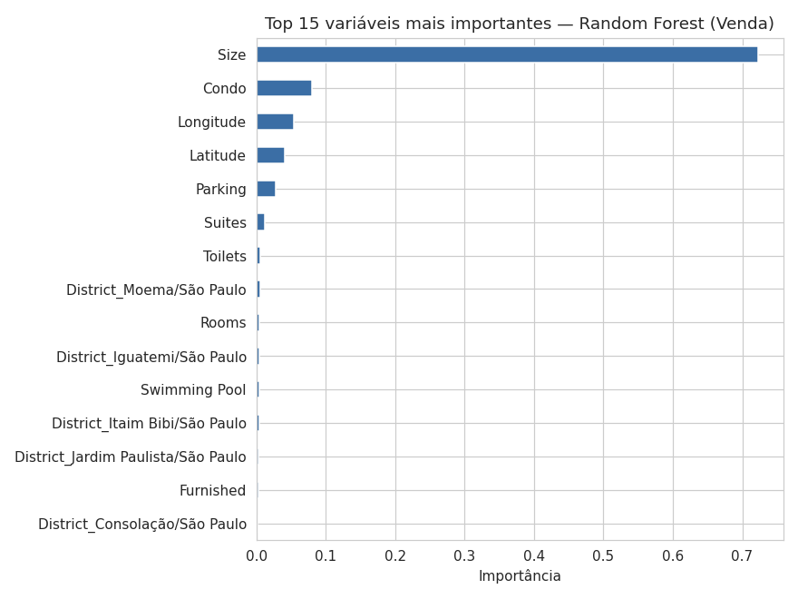
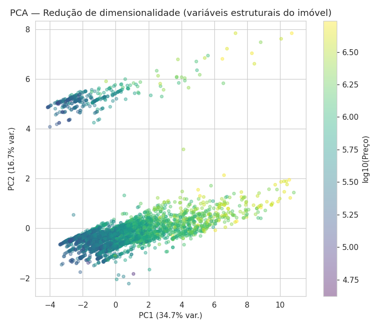
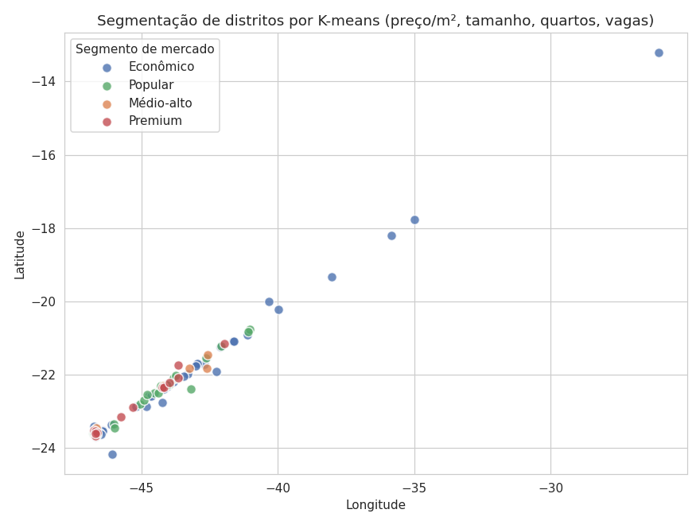
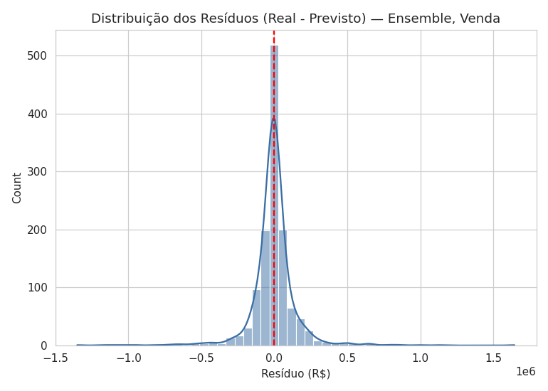

# 🏠 Análise Exploratória e Solução: Previsão de Preços de Imóveis em São Paulo

### Projeto de Ciência de Dados, EBAC

Projeto de Ciência de Dados desenvolvido com o objetivo de analisar o mercado imobiliário de São Paulo e construir modelos capazes de prever preços de imóveis a partir de suas características.

A análise considera imóveis para venda e aluguel, explorando características como tamanho, quantidade de cômodos, suítes, vagas de garagem, infraestrutura e localização.

> ⚠️ **Importante:** os dados utilizados são de abril de 2019. Portanto, os valores e padrões encontrados representam o mercado observado naquele período e não devem ser interpretados como preços atuais de 2026.

---

## 🎯 1. Objetivo do projeto

### Problema de negócio

**Como prever o valor de imóveis, para venda e aluguel, na cidade de São Paulo a partir de suas características, reduzindo a assimetria de informação entre compradores, locatários e o mercado imobiliário?**

O projeto busca responder essa questão por meio de:

- análise exploratória dos dados;
- identificação dos principais fatores associados aos preços;
- comparação entre imóveis para venda e aluguel;
- análise dos preços por localização;
- construção e comparação de modelos de Machine Learning;
- análise de erros e resíduos;
- redução de dimensionalidade com PCA;
- segmentação de distritos utilizando K-Means.

---

## 📊 2. Sobre os dados

### Fonte

**São Paulo Real Estate, Sale/Rent, April 2019**

Dataset público e anonimizado, disponibilizado no Kaggle, com informações coletadas de sites de classificados imobiliários.

### Dataset utilizado

`dados/sao-paulo-properties-april-2019.csv`

### Dimensões da base

- **13.640 registros**
- **16 variáveis**
- **96 distritos**
- Apenas imóveis do tipo **apartment**
- Não foram identificados valores ausentes na base

### Principais variáveis

| Variável | Descrição |
|---|---|
| `Price` | Preço do imóvel |
| `Condo` | Valor do condomínio |
| `Size` | Tamanho do imóvel |
| `Rooms` | Quantidade de cômodos |
| `Toilets` | Quantidade de banheiros |
| `Suites` | Quantidade de suítes |
| `Parking` | Quantidade de vagas |
| `Elevator` | Presença de elevador |
| `Furnished` | Imóvel mobiliado |
| `Swimming Pool` | Presença de piscina |
| `New` | Imóvel novo |
| `District` | Distrito |
| `Negotiation Type` | Tipo de negociação |
| `Property Type` | Tipo do imóvel |
| `Latitude` | Latitude |
| `Longitude` | Longitude |

---

## 🔎 3. Análise exploratória

Como os preços de venda e aluguel possuem escalas muito diferentes, as análises foram realizadas separadamente para evitar interpretações distorcidas.

### 3.1 Distribuição dos preços

Foram analisadas as distribuições dos preços de venda e aluguel.

Na base:

- **6.412 imóveis para venda**
- **7.228 imóveis para aluguel**
- Preço médio de venda de aproximadamente **R$ 608 mil**
- Mediana de venda de aproximadamente **R$ 380 mil**
- Preço médio de aluguel de aproximadamente **R$ 3.078**
- Mediana de aluguel de aproximadamente **R$ 2.000**



---

### 3.2 Correlação entre variáveis

A matriz de correlação foi utilizada para identificar relações entre as características dos imóveis e seus preços.



---

### 3.3 Preço x tamanho do imóvel

A relação entre tamanho e preço foi analisada para verificar como a área do imóvel está associada ao valor dos imóveis.

A análise mostra uma tendência de aumento dos preços conforme o tamanho aumenta, mas a relação não é perfeitamente linear. Isso reforça a importância de considerar outras características do imóvel e sua localização.



---

### 3.4 Efeito da localização: preço por m² entre distritos

O preço médio por metro quadrado foi calculado para comparar imóveis de diferentes tamanhos entre os distritos.

O gráfico apresenta os oito distritos com maior preço médio por m² e os oito com menor preço médio por m².

Essa análise evidencia a forte influência da localização na formação dos preços dos imóveis.



---

## 🤖 4. Modelagem de Machine Learning

Foram utilizados diferentes algoritmos de regressão para prever o preço dos imóveis.

### Modelos avaliados

- Linear Regression
- Decision Tree Regressor
- Random Forest Regressor
- Gradient Boosting Regressor
- Ensemble com Random Forest + Gradient Boosting

Os dados foram separados em conjuntos de treinamento e teste utilizando `train_test_split`.

A modelagem foi realizada separadamente para imóveis à venda e imóveis para aluguel, devido às diferenças entre as escalas e características dos dois mercados.

---

## 📈 5. Avaliação dos modelos

Foram utilizadas três métricas principais:

- **MAE**, erro absoluto médio;
- **RMSE**, raiz do erro quadrático médio;
- **R²**, coeficiente de determinação.

Quanto menor o MAE e o RMSE, melhor. Para o R², valores mais próximos de 1 indicam maior capacidade explicativa do modelo.

### Resultados, imóveis para venda

| Modelo | MAE | RMSE | R² |
|---|---:|---:|---:|
| Linear Regression | R$ 131.569 | R$ 217.837 | 0,836 |
| Decision Tree | R$ 114.095 | R$ 212.017 | 0,844 |
| Random Forest | R$ 86.531 | R$ 167.430 | 0,903 |
| Gradient Boosting | R$ 93.199 | R$ 175.114 | 0,894 |
| Ensemble RF + GB | R$ 86.994 | R$ 166.044 | **0,905** |

O Ensemble com Random Forest e Gradient Boosting apresentou o maior R², aproximadamente **0,905**, enquanto o Random Forest apresentou MAE ligeiramente menor.



---

## 🎯 6. Valores reais x valores preditos

A comparação entre os valores reais e previstos permite observar visualmente o desempenho do Ensemble.

Quanto mais próximos os pontos estiverem da linha de referência, melhor é a correspondência entre o preço observado e o preço estimado.



---

## 🌳 7. Importância das variáveis

A importância das variáveis foi analisada utilizando o modelo Random Forest.

Essa etapa permite entender quais características contribuíram mais para as previsões realizadas pelo modelo.

Entre os fatores analisados estão:

- tamanho do imóvel;
- localização;
- quantidade de cômodos;
- suítes;
- vagas de garagem;
- características de infraestrutura.



---

## 🏢 8. Resultado para imóveis de aluguel

Também foi desenvolvido um modelo específico para os imóveis destinados ao aluguel, utilizando a mesma metodologia aplicada aos imóveis para venda.

Os resultados para aluguel apresentaram desempenho inferior ao observado na previsão dos preços de venda, com R² aproximadamente entre **0,69 e 0,78**, dependendo do modelo.

Esse resultado indica que outras variáveis não presentes na base podem ter influência relevante sobre os valores de aluguel.

---

## 🧩 9. PCA, redução de dimensionalidade

Foi utilizada a técnica de **PCA, Principal Component Analysis**, após a padronização das variáveis numéricas.

Os dois primeiros componentes explicaram aproximadamente:

- **PC1: 34,7%**
- **PC2: 16,7%**
- **PC1 + PC2: 51,5%**

O primeiro componente apresentou forte relação com características como:

- `Toilets`
- `Suites`
- `Size`
- `Parking`
- `Rooms`
- `Condo`

Já o segundo componente apresentou forte relação com:

- `Latitude`
- `Longitude`

Isso indica que a localização possui uma dimensão própria importante dentro da estrutura dos dados.



---

## 🗺️ 10. Segmentação dos distritos com K-Means

Para complementar a análise, foi utilizado o algoritmo **K-Means** para segmentar os distritos em quatro perfis de mercado.

Os grupos foram interpretados como:

1. **Econômico**
2. **Popular**
3. **Médio-alto**
4. **Premium**

A segmentação considerou características como preço por metro quadrado, tamanho médio, quantidade de cômodos e vagas de garagem.



---

## 📉 11. Análise dos resíduos

A distribuição dos resíduos foi utilizada para avaliar o comportamento dos erros do Ensemble.

O resíduo representa a diferença entre o valor real e o valor previsto.

Essa análise ajuda a identificar padrões de erro e verificar se o modelo apresenta tendências sistemáticas de superestimação ou subestimação.



---

## 📐 12. Análise probabilística dos erros

Foi realizado um procedimento de **bootstrap com 1.000 reamostragens** para estimar um intervalo de confiança de 95% para o MAE.

O intervalo encontrado foi aproximadamente:

**R$ 79.631 a R$ 95.180**

O erro médio residual ficou próximo de:

**R$ -4.570**

Essa análise adiciona uma perspectiva estatística à avaliação do modelo, permitindo observar a incerteza associada à estimativa do erro.

---

## 💡 13. Principais resultados

A análise permitiu identificar alguns pontos relevantes:

- O tamanho do imóvel possui forte relação com o preço.
- A localização apresenta influência importante sobre os valores.
- O preço por metro quadrado permite comparar melhor diferentes distritos.
- Modelos baseados em árvores apresentaram desempenho superior à regressão linear.
- O Random Forest apresentou MAE de aproximadamente **R$ 86,5 mil** para imóveis à venda.
- O Ensemble apresentou o maior R², aproximadamente **0,905**.
- A previsão de aluguel apresentou desempenho inferior ao observado para venda.
- A análise de PCA mostrou que características físicas e localização possuem papéis distintos na estrutura dos dados.
- O K-Means permitiu identificar quatro perfis de mercado entre os distritos.
- A análise dos resíduos e o bootstrap complementaram a avaliação do desempenho do modelo.

---

## ⚠️ 14. Limitações

Apesar dos resultados obtidos, o projeto apresenta algumas limitações importantes.

### Dados históricos

O dataset representa o mercado imobiliário de **abril de 2019**. Dessa forma, os modelos não devem ser utilizados diretamente para estimar preços atuais sem uma nova etapa de atualização e validação.

### Variáveis disponíveis

A base não contempla todos os fatores que podem influenciar o preço de um imóvel.

Variáveis como:

- estado de conservação;
- andar;
- idade do imóvel;
- distância até transporte público;
- proximidade de escolas e hospitais;
- segurança da região;
- qualidade da infraestrutura local;
- características específicas do condomínio;

poderiam contribuir para melhorar as previsões.

### Generalização

Os resultados refletem o conjunto de dados utilizado no projeto e não garantem o mesmo desempenho em bases mais recentes ou em outras cidades.

---

## 🚀 15. Trabalhos futuros

Como possíveis evoluções do projeto, podem ser consideradas:

1. Atualização da base com dados mais recentes.
2. Inclusão de novas variáveis relacionadas à localização e características dos imóveis.
3. Utilização de técnicas de seleção e engenharia de atributos.
4. Teste de modelos adicionais, como XGBoost, LightGBM e CatBoost.
5. Otimização dos hiperparâmetros dos modelos.
6. Validação cruzada.
7. Desenvolvimento de uma aplicação para consulta de preços estimados.
8. Criação de um dashboard interativo para exploração dos dados.

---

## 🛠️ 16. Tecnologias utilizadas

- Python
- Pandas
- NumPy
- Matplotlib
- Seaborn
- Scikit-learn
- Jupyter Notebook
- Git
- GitHub

---

## 📁 17. Estrutura do projeto

```text
projeto-precos-imoveis-sp/
│
├── 📓 projeto_precos_imoveis_sp.ipynb
│
├── 📂 dados/
│   └── sao-paulo-properties-april-2019.csv
│
├── 📂 images/
│   ├── distribuicao_precos.png
│   ├── matriz_correlacao.png
│   ├── preco_tamanho.png
│   ├── preco_m2_distrito.png.png
│   ├── comparacao_modelos.png
│   ├── real_predito.png
│   ├── feature_importance.png
│   ├── pca.png
│   ├── clusters_distritos.png
│   └── distribuicao_residuos.png
│
└── README.md
```

---

## ▶️ 18. Como executar

### 1. Clone o repositório

```bash
git clone URL_DO_SEU_REPOSITORIO
```

### 2. Acesse a pasta

```bash
cd projeto-precos-imoveis-sp
```

### 3. Instale as bibliotecas

```bash
pip install pandas numpy matplotlib seaborn scikit-learn jupyter
```

### 4. Abra o notebook

```bash
jupyter notebook
```

### 5. Execute as células

Abra o arquivo:

```text
projeto_precos_imoveis_sp.ipynb
```

e execute as células em ordem.

---

## 📚 19. Competências desenvolvidas

- Análise exploratória de dados
- Tratamento e preparação de dados
- Análise estatística
- Visualização de dados
- Engenharia de atributos
- Regressão
- Machine Learning
- Avaliação de modelos
- Análise de resíduos
- Bootstrap
- PCA
- Clusterização com K-Means
- Interpretação de resultados
- Comunicação de resultados de Data Science

---

## 🎓 20. Sobre o projeto

Projeto desenvolvido como parte da formação em **Ciência de Dados pela EBAC**, com foco na aplicação prática de técnicas de análise de dados e Machine Learning para solucionar um problema relacionado ao mercado imobiliário.

O projeto busca unir análise exploratória, estatística e Machine Learning em um fluxo completo, desde a compreensão dos dados até a avaliação e interpretação dos modelos.

---

## 👤 Autor

**Antônio Gabriel Vieira Araújo**

🔗 [LinkedIn](https://www.linkedin.com/in/gabrielaraujo05/)  
🔗 [GitHub](https://github.com/Gabriel-Araujo-dev)
